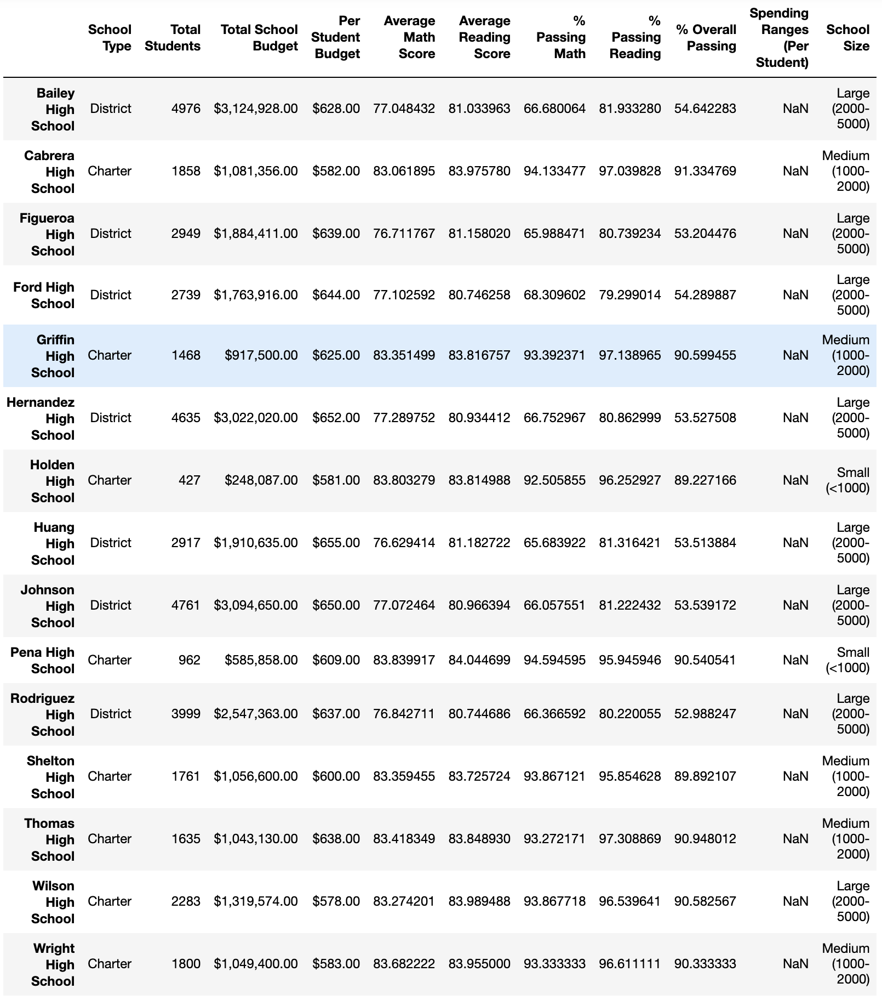
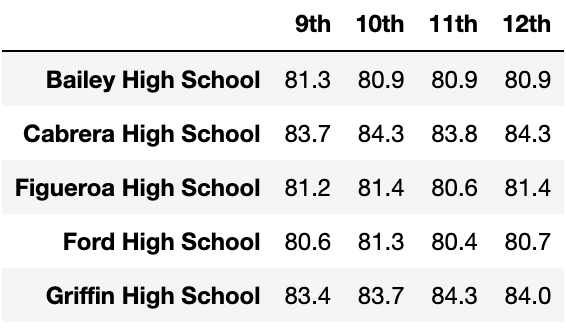
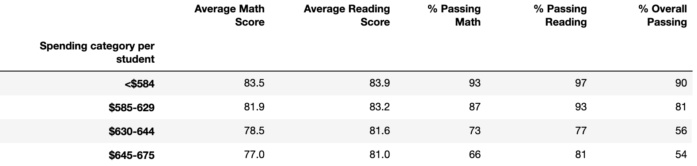
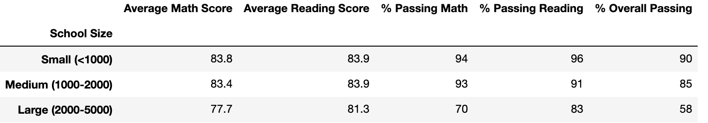

# **School_District_Analysis**

### ***Overview of the school district analysis***
The purpose of the analysis is to identify the performance in math and reading subjects on a group of high schools whose students belong to an specific district which is the object of analysis.
The analysis uses `pandas library` [pandas DataFrame](https://pandas.pydata.org/docs/reference/api/pandas.DataFrame.to_pickle.html#pandas.DataFrame.to_pickle)./ As part of the libraries that can be release in Jupyter Notebook>Anacanda. "This packages support the Python and R programming languages for data science, machine learning, and data processing, among other data-related tasks." > Washington University of St. Louise

### ***Results***
The final results takes into consideration the ``schools_complete.csv`` which this files shows evidence of academic dishonesty. The analysis has replaced the math and reading scores for Thomas High School. Therefore, after repeating the analysis by district, school levels to get the new scores. The outcomes are as it is explained:

- *How is the district summary affected?*

By looking at the district leel of data, the initial analysis summary shows 15 schools with a total budget of $24.6M with an overall passing % of 65.17.

However, with the clean and updated data, the overall passing % is 64.9, although the total students do not change for the outcome of this figure.

- *How is the school summary affected?*
The school summary did not show any changes between the two sets od data, because the analysis kept the ``school_complete.csv`` and ``students_complete.csv`` in the munging. 

- *How does replacing the ninth graders’ math and reading scores affect Thomas High School’s performance relative to the other schools?*

The only performance affected by the deshonesty behavior from Thomas High School is this school itself. The rest of the high schools did not get affected during the analysis.

- *How does replacing the ninth-grade scores affect the following:*
    - Math and reading scores by grade
    
    
    - Scores by school spending
    
    
    - Scores by school size
    
    
    - Scores by school type
    

### ***Summary***
The four changes in the updated school district analysis after reading and math scores for the ninth grade at Thomas High School  have replaced with NaNs.
